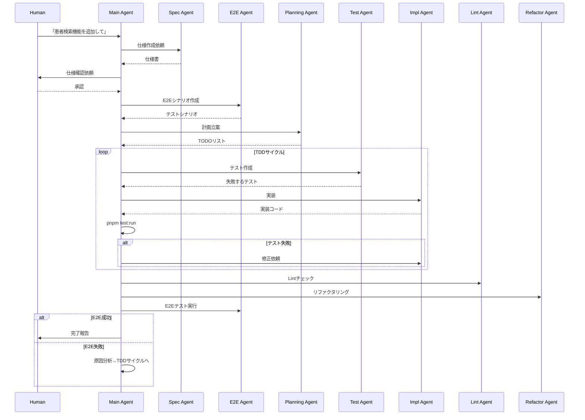

# AI駆動開発プロセス設計

## 概要

Claude Codeを活用したAI駆動開発プロセスの設計書。Main Agent（オーケストレーター）とSpecialized Sub Agents（専門エージェント）の協調により、TDDベースの高品質な開発を実現する。

## アーキテクチャ概念図

```
┌─────────────────────────────────────────────────────────────────┐
│                      Human Developer                             │
│                    （要求・フィードバック）                        │
└─────────────────────────────────────────────────────────────────┘
                              │
                              ▼
┌─────────────────────────────────────────────────────────────────┐
│                    Main Agent (Orchestrator)                     │
│  ┌─────────────────────────────────────────────────────────────┐│
│  │ - 全体フロー制御                                              ││
│  │ - 状態管理（現在フェーズ、進捗、エラー状態）                    ││
│  │ - Sub Agent の起動・結果評価                                  ││
│  │ - 意思決定（進行/ループバック/人間への確認）                    ││
│  │ - TodoWrite によるタスク管理                                  ││
│  └─────────────────────────────────────────────────────────────┘│
└─────────────────────────────────────────────────────────────────┘
          │              │              │              │
          ▼              ▼              ▼              ▼
    ┌─────────┐    ┌─────────┐    ┌─────────┐    ┌─────────┐
    │ Spec    │    │ Test    │    │ Impl    │    │ Quality │
    │ Agent   │    │ Agent   │    │ Agent   │    │ Agent   │
    └─────────┘    └─────────┘    └─────────┘    └─────────┘
```

---

## Main Agent の役割と振る舞い

### 責務

1. **フロー制御**: 開発プロセス全体のオーケストレーション
2. **状態管理**: 各フェーズの進捗・結果を追跡
3. **意思決定**: 次のステップへ進むか、ループバックするかを判断
4. **人間との対話**: 曖昧な要件の明確化、重要な決定の確認
5. **タスク管理**: TodoWriteで進捗を可視化

### フロー制御ロジック

```typescript
// Main Agent の擬似コード
async function orchestrate(featureRequest: string) {
  // Phase 1: 計画フェーズ
  const spec = await invokeSubAgent('spec-agent', { request: featureRequest });
  await askUserForApproval('仕様を確認してください', spec);

  const e2eScenarios = await invokeSubAgent('e2e-scenario-agent', { spec });
  const plan = await invokeSubAgent('planning-agent', { spec, e2eScenarios });

  // Phase 2: TDD開発サイクル
  let iteration = 0;
  let allTestsPassing = false;

  while (!allTestsPassing && iteration < MAX_ITERATIONS) {
    // Red: 失敗するテストを作成
    const tests = await invokeSubAgent('test-first-agent', { spec, plan });

    // Green: テストを通す実装
    const implementation = await invokeSubAgent('implementation-agent', { tests, spec });

    // テスト実行
    const unitTestResult = await runCommand('pnpm test:run');

    if (!unitTestResult.success) {
      iteration++;
      continue; // 実装を修正
    }

    // Lint チェック
    const lintResult = await runCommand('pnpm lint');
    if (!lintResult.success) {
      await invokeSubAgent('lint-fix-agent', { errors: lintResult.errors });
      continue;
    }

    // Refactor
    await invokeSubAgent('refactor-agent', { implementation });

    // E2E テスト
    const e2eResult = await runCommand('pnpm test:e2e');
    allTestsPassing = e2eResult.success;

    if (!allTestsPassing) {
      // E2E失敗時は要件の見直しか実装修正
      await analyzeE2EFailure(e2eResult);
      iteration++;
    }
  }

  return { success: allTestsPassing, iterations: iteration };
}
```

### 意思決定ポイント

| 状況 | 判断基準 | アクション |
|------|----------|------------|
| 仕様が曖昧 | 要件に不明点がある | AskUserQuestion で確認 |
| テスト失敗 | ユニットテスト失敗 | implementation-agent を再実行 |
| Lint エラー | 自動修正可能か判断 | lint-fix-agent または手動修正 |
| E2E 失敗 | 仕様問題 vs 実装問題 | spec見直し or 実装修正 |
| 繰り返し超過 | iteration > 5 | 人間に相談 |

---

## Sub Agents 設計

### 1. Spec Agent (仕様作成エージェント)

**目的**: 機能要件から詳細な技術仕様書を作成

```yaml
name: spec-agent
description: |
  機能要件を分析し、詳細な技術仕様書を作成する。
  既存コードベースとの整合性を確認し、実装可能な仕様に落とし込む。

tools:
  - Read          # 既存コード・ドキュメントの読み取り
  - Glob          # ファイル検索
  - Grep          # コード内検索
  - WebFetch      # 外部ドキュメント参照
  - Write         # 仕様書の出力

input:
  - feature_request: string  # ユーザーからの機能要求
  - context: string          # プロジェクトコンテキスト

output:
  - spec_document: string    # 仕様書（Markdown）
  - affected_files: string[] # 影響を受けるファイル一覧
  - dependencies: string[]   # 必要な依存関係

behavior:
  1. 既存のCLAUDE.mdとdocs/を読み込む
  2. 関連する既存実装を調査
  3. 仕様書テンプレートに従って文書化
  4. データモデル・API・UIの変更点を明確化
  5. docs/specs/{feature-name}.md に出力
```

### 2. E2E Scenario Agent (E2Eシナリオ作成エージェント)

**目的**: ユーザー視点の受け入れ基準をPlaywrightテストシナリオとして定義

```yaml
name: e2e-scenario-agent
description: |
  仕様書からE2Eテストシナリオを作成する。
  ユーザーの操作フローを再現し、受け入れ基準を明確化。

tools:
  - Read          # 仕様書・既存テストの読み取り
  - Glob          # テストファイル検索
  - Write         # テストファイル出力

input:
  - spec: string           # 仕様書
  - existing_fixtures: string  # 既存のテストフィクスチャ

output:
  - test_scenarios: TestScenario[]
  - test_file_path: string

behavior:
  1. 仕様書からユーザーストーリーを抽出
  2. 各ストーリーをテストシナリオに変換
  3. 既存のfixtures.tsとの整合性確認
  4. tests/e2e/{feature}.spec.ts を作成
  5. シナリオには test.skip() を付けて作成（後で有効化）

template: |
  import { test, expect } from '@playwright/test';
  import { TEST_CONFIG, TEST_IDS } from './fixtures';

  test.describe('{Feature Name}', () => {
    test.skip('{Scenario 1}', async ({ page }) => {
      // TODO: 実装後に有効化
    });
  });
```

### 3. Planning Agent (計画エージェント)

**目的**: 開発計画を立案し、TODOリストを作成

```yaml
name: planning-agent
description: |
  仕様書とE2Eシナリオから実装計画を立案。
  タスクを分解し、依存関係を考慮した実行順序を決定。

tools:
  - Read          # 仕様書・テストの読み取り
  - Glob          # 既存実装の調査
  - TodoWrite     # タスクリスト管理

input:
  - spec: string
  - e2e_scenarios: TestScenario[]
  - codebase_context: string

output:
  - implementation_plan: ImplementationStep[]
  - todo_list: Todo[]
  - estimated_complexity: 'low' | 'medium' | 'high'

behavior:
  1. 必要な変更を層別に分類（DB/API/UI）
  2. 依存関係グラフを作成
  3. 最小実装単位（テスト可能な単位）に分解
  4. TodoWriteでタスクリストを作成
  5. 各タスクに「テスト作成→実装→検証」のサブタスクを含める
```

### 4. Test-First Agent (テスト作成エージェント)

**目的**: TDDの「Red」フェーズ - 失敗するユニットテストを作成

```yaml
name: test-first-agent
description: |
  実装前にユニットテストを作成する。
  テストは最初は失敗することを期待（TDD Red Phase）。

tools:
  - Read          # 仕様・既存テストの読み取り
  - Glob          # テストファイル検索
  - Write         # テストファイル作成
  - Bash          # テスト実行（失敗確認）

input:
  - spec: string
  - implementation_plan: ImplementationStep
  - existing_tests: string[]

output:
  - test_files: TestFile[]
  - expected_failures: string[]

behavior:
  1. 実装対象の関数/コンポーネントを特定
  2. エッジケースを含むテストケースを設計
  3. tests/unit/{module}.test.ts を作成
  4. pnpm test:run で失敗を確認
  5. 失敗理由が「実装がない」ことを確認

test_template: |
  import { describe, it, expect } from 'vitest';
  import { functionToTest } from '$lib/path/to/module';

  describe('functionToTest', () => {
    it('should handle normal case', () => {
      expect(functionToTest(input)).toBe(expectedOutput);
    });

    it('should handle edge case', () => {
      expect(() => functionToTest(invalidInput)).toThrow();
    });
  });
```

### 5. Implementation Agent (実装エージェント)

**目的**: TDDの「Green」フェーズ - テストを通す最小限の実装

```yaml
name: implementation-agent
description: |
  失敗しているテストを通すための実装を行う。
  最小限の実装を心がけ、過度な抽象化は避ける。

tools:
  - Read          # テスト・既存コードの読み取り
  - Glob          # ファイル検索
  - Grep          # コード検索
  - Edit          # コード編集
  - Write         # 新規ファイル作成
  - Bash          # テスト実行

input:
  - failing_tests: TestFile[]
  - spec: string
  - existing_codebase: string

output:
  - modified_files: string[]
  - new_files: string[]
  - test_results: TestResult

behavior:
  1. 失敗しているテストを分析
  2. 最小限の実装を作成
  3. pnpm test:run でテスト実行
  4. 全テストがパスするまで修正
  5. 過度な抽象化・最適化は行わない（Refactorフェーズで実施）

principles:
  - YAGNI（今必要なものだけ実装）
  - テストが通る最小限のコード
  - 既存コードスタイルに準拠
```

### 6. Lint Fix Agent (Lint修正エージェント)

**目的**: ESLintエラー・警告を自動修正

```yaml
name: lint-fix-agent
description: |
  Lintエラーを検出し、可能な限り自動修正する。
  自動修正できない場合は修正提案を行う。

tools:
  - Bash          # lint実行
  - Read          # エラー箇所の読み取り
  - Edit          # コード修正

input:
  - lint_errors: LintError[]
  - affected_files: string[]

output:
  - fixed_count: number
  - remaining_errors: LintError[]
  - manual_fixes_needed: ManualFix[]

behavior:
  1. pnpm lint:fix で自動修正を試行
  2. 残りのエラーを分析
  3. 各エラータイプに応じた修正を実施
  4. 再度lintを実行して確認
```

### 7. Refactor Agent (リファクタリングエージェント)

**目的**: TDDの「Refactor」フェーズ - コード品質の向上

```yaml
name: refactor-agent
description: |
  テストが通った後、コードの品質を向上させる。
  可読性・再利用性・保守性を改善。

tools:
  - Read          # コード読み取り
  - Grep          # パターン検索
  - Edit          # コード編集
  - Bash          # テスト実行（リグレッション確認）

input:
  - implementation: string[]
  - test_coverage: CoverageReport
  - code_metrics: CodeMetrics

output:
  - refactored_files: string[]
  - improvements: Improvement[]
  - test_results: TestResult  # リグレッションがないこと

refactoring_checklist:
  - [ ] 重複コードの抽出
  - [ ] 長い関数の分割
  - [ ] 命名の改善
  - [ ] 型の厳密化
  - [ ] コメントの追加（複雑なロジックのみ）
  - [ ] 不要なコードの削除

behavior:
  1. コードメトリクスを分析（複雑度、行数など）
  2. リファクタリング対象を特定
  3. 小さな変更を段階的に実施
  4. 各変更後にテスト実行
  5. テストが失敗したら変更を取り消し
```

### 8. E2E Test Agent (E2Eテスト実行エージェント)

**目的**: E2Eテストを実行し、結果を分析

```yaml
name: e2e-test-agent
description: |
  E2Eテストを実行し、失敗時は原因を分析する。
  スクリーンショットやログから問題を特定。

tools:
  - Bash          # テスト実行
  - Read          # テストファイル・ログ読み取り
  - Glob          # スクリーンショット検索

input:
  - test_files: string[]
  - skip_patterns: string[]  # スキップするテスト

output:
  - passed: boolean
  - results: E2ETestResult[]
  - failure_analysis: FailureAnalysis[]
  - screenshots: string[]

behavior:
  1. test.skip() を外してテストを有効化
  2. pnpm test:e2e を実行
  3. 失敗したテストの原因を分析
  4. playwright-report/ のスクリーンショットを確認
  5. 失敗原因を分類（UI/API/データ/タイミング）
```

---

## ワークフロー例

### 新機能開発フロー



---

## 設定ファイル例

### .claude/agents/spec-agent.md

```markdown
# Spec Agent

あなたは機能仕様を作成するエージェントです。

## 役割
- 機能要件を技術仕様に変換
- 既存アーキテクチャとの整合性確認
- 実装可能性の検証

## 出力フォーマット

### 機能仕様書: {機能名}

#### 1. 概要
{機能の目的と価値}

#### 2. ユーザーストーリー
- As a {ユーザー}, I want {機能}, so that {価値}

#### 3. 機能要件
- [ ] 要件1
- [ ] 要件2

#### 4. 技術設計

##### データモデル
```typescript
// 追加/変更するスキーマ
```

##### API設計
| Method | Path | Description |
|--------|------|-------------|
| GET    | /api/... | ... |

##### UI設計
- 画面: {画面名}
- コンポーネント: {コンポーネント一覧}

#### 5. 影響範囲
- 変更ファイル: ...
- 新規ファイル: ...

#### 6. テスト計画
- ユニットテスト: ...
- E2Eテスト: ...
```

---

## 並列実行の最適化

### 並列実行可能なタスク

```
┌─────────────────────────────────────────────────┐
│ Spec作成後、以下を並列実行可能:                  │
│                                                 │
│   ┌──────────────┐   ┌──────────────┐          │
│   │ E2Eシナリオ  │   │ 計画立案    │          │
│   │ 作成         │   │             │          │
│   └──────────────┘   └──────────────┘          │
│          │                  │                  │
│          └────────┬─────────┘                  │
│                   ▼                            │
│          ┌──────────────┐                      │
│          │ テスト作成   │                      │
│          └──────────────┘                      │
└─────────────────────────────────────────────────┘
```

### バックグラウンド実行

```typescript
// テスト実行をバックグラウンドで行い、結果を待機
const testTask = await Task({
  subagent_type: 'test-runner',
  run_in_background: true,
  prompt: 'Run unit tests'
});

// 別の作業を並行実行
await performOtherTasks();

// テスト結果を取得
const testResult = await TaskOutput({ task_id: testTask.id });
```

---

## エラーハンドリング

### リトライ戦略

| エラー種別 | リトライ回数 | 待機時間 | フォールバック |
|-----------|-------------|---------|--------------|
| テスト失敗 | 3回 | なし | 人間に相談 |
| Lintエラー | 2回 | なし | 手動修正依頼 |
| E2E失敗 | 2回 | 5秒 | 仕様見直し |
| タイムアウト | 1回 | 30秒 | タスク分割 |

### エスカレーション条件

```typescript
const shouldEscalateToHuman = (context: Context): boolean => {
  return (
    context.iterations > 5 ||
    context.consecutiveFailures > 3 ||
    context.hasArchitecturalDecision ||
    context.affectsSecurityCriticalCode ||
    context.estimatedComplexity === 'high'
  );
};
```

---

## 品質メトリクス

### 自動収集するメトリクス

- テストカバレッジ（目標: 80%以上）
- Lint警告数（目標: 0）
- 複雑度（Cyclomatic Complexity < 10）
- 重複コード率（< 5%）
- ビルド時間

### 成功基準

```yaml
success_criteria:
  unit_tests:
    coverage: ">= 80%"
    pass_rate: "100%"

  lint:
    errors: 0
    warnings: "< 10"

  e2e_tests:
    pass_rate: "100%"

  build:
    success: true
    time: "< 60s"
```
